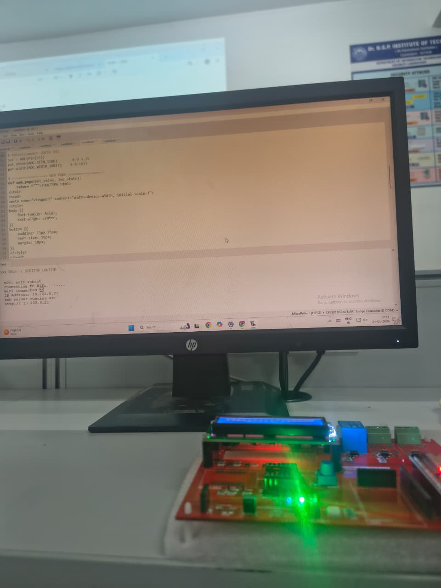

# ESP32 Light Monitoring using MQTT:
# Project Overview

This project demonstrates a smart room light monitoring system using ESP32, MQTT, and a Python dashboard.

A potentiometer acts as an analog switch:

-Minimum value → Light OFF

-Maximum value → Light ON

The ESP32 publishes the light status to an MQTT broker, and a PC dashboard subscribes to display the status in real time.

# Technologies Used

-ESP32 (MicroPython)

-MQTT Protocol

-Python (Paho-MQTT)

-Wi-Fi Communication

-ADC (Potentiometer input)

# Working Flow

-Potentiometer → ESP32 → MQTT Broker → PC Dashboard

# System Architecture

Potentiometer(Analog Input) --> ESP32 (ADC + Decision) --> MQTT Broker (test.mosquitto.org) --> PC Dashboard (Python Subscriber)

